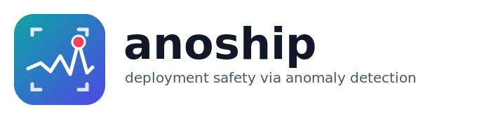

<p align="center">
  
</p>

<h3 align="center">Anomaly-detection-driven deployment safety for production AI/ML systems</h3>

<p align="center">
  <a href="LICENSE"></a>
  
  <a href="https://github.com/xiaohanc/anoship/actions/workflows/ci.yml"></a>
  
  <a href="docs/CONTRIBUTING.md"></a>
  
</p>

<p align="center">
  <a href="#-why-it-exists">Why</a> ·
  <a href="#-install">Install</a> ·
  <a href="#-quickstart">Quickstart</a> ·
  <a href="#-detectors--the-pluggable-core">Detectors</a> ·
  <a href="#-the-deployment-pipeline">Pipeline</a> ·
  <a href="docs/ARCHITECTURE.md">Architecture</a> ·
  <a href="docs/CONTRIBUTING.md">Contributing</a>
</p>

---

`anoship` treats deployment safety as an **anomaly-detection problem over evolving
streams** of model outputs, input features, and downstream indicators — and wraps
that detection core in a **self-evaluating deployment pipeline**: progressive
rollout → anomaly-detection-powered health gating → automated rollback →
standardized observability.

The framework is **modular and pluggable**: the anomaly-detection methods at its
core are interchangeable, so each organization can choose the detector that fits
its data and risk profile. The built-in detectors are reference implementations
of peer-reviewed anomaly-detection methods (see the
[paper → module map](#-detectors--the-pluggable-core)).

> **Scope.** This repository is a clean-room **reference implementation of the
> methodology** — it is designed to be readable, runnable, and adoptable, not to
> reproduce any proprietary production system. It depends only on NumPy for its
> core, so it installs and runs in seconds.

---

## 🎯 Why it exists

Modern AI systems fail in subtle ways: a model update degrades quality without
crashing, a feature distribution drifts, a downstream indicator slowly regresses.
These failures are hard to detect and slow to mitigate. `anoship` makes
deployment **controlled, measurable, and resilient** by detecting abnormal
behavior under real conditions, attributing likely causes, and automatically
gating or rolling back before damage spreads.

---

## 📦 Install

anoship is a **monorepo of composable packages** that share the `anoship.*`
namespace. Install all of them in editable mode for development:

```bash
bash scripts/dev_install.sh        # installs all 5 packages (editable)
```

Or pick only the components you need (each is independently installable):

```bash
pip install -e anoship-core         # interfaces, registry, config, types
pip install -e anoship-signals      # windowing, channels, synthetic streams
pip install -e anoship-detection    # detectors + scoring + attribution
pip install -e anoship-pipeline     # rollout, gating, rollback, observability
pip install -e anoship-app          # API, CLI, scenarios, reporting, adapters
pip install -e "anoship-app[torch]" # + PyTorch adapter for real published models
```

## ⚡ Quickstart

```bash
anoship list                                   # show all pluggable components
anoship run --scenario regression --detector diffusion --risk-tier high_impact
anoship run --config configs/high_impact.yaml --json run.json
```

```python
import anoship.app as ans   # one import wires up the whole framework

scn = ans.build_scenario("regression")
pipeline = ans.DeploymentPipeline(
    detector=ans.DETECTORS.create("diffusion"),
    rollout=ans.ROLLOUTS.create("canary"),
    policy=ans.POLICIES.create("risk_aware"),
    risk_tier="high_impact",
).fit(scn.baseline)

report = pipeline.run(scn.source)
print(report.summary.root_cause)   # -> "likely source: ch0 (36%), ch1 (31%), ..."
print(report.rolled_back)          # -> True (caught and mitigated automatically)
```

---

## 🧩 Detectors — the pluggable core

Every detector implements one interface (`fit` / `score` / `is_anomaly`) and is
registered under a name. The built-ins are reference implementations of
peer-reviewed methods:

| Detector (`name`)   | Method / idea                                            | Publication |
|---------------------|----------------------------------------------------------|-------------|
| `habituation`       | Habituation clustering suppresses familiar patterns to cut false alarms | *Anti-Drosophila Habituation Clustering for Enhanced Anomaly Detection in Data Streams*, IEEE ISCIPT 2025 |
| `causal`            | Inter-channel causal/dependency residuals → fine-grained root cause | *Fine-Grained Multivariate Time Series Anomaly Detection via Causal Inference*, Knowledge-Based Systems 2025 |
| `diffusion`         | Multi-step denoising + cross-step consistency disentangles anomalies from noise | *Toward Robust Anomaly Detection in Noisy Time Series via Diffusion-Driven Denoising and Disentanglement*, J. Supercomputing 2026; *Diffusion-Step Attention Consistency for MTS AD*, KBS 2026 |
| `spatiotemporal`    | Fuses level/temporal/spatial dependency views; handles non-stationarity | *MSTDF-AD: Modeling Spatiotemporal Dependency Fusion for Non-Stationary Time Series Anomaly Detection*, Information Processing & Management 2026 |
| `ewma`              | EWMA-residual baseline (control)                         | — |

A full PyTorch model (the companion **MSTDF-AD** repo) plugs into the *same*
interface via `anoship.adapters.torch_mstdf`; scikit-learn estimators via
`anoship.adapters.sklearn`.

### Detector choice matters

Output of `python examples/end_to_end.py` (canary rollout, standard risk tier):

```
detector             healthy  regression       drift       spike       noisy
----------------------------------------------------------------------------
ewma                complete    complete    complete    rollback    rollback
habituation         complete    rollback    rollback    rollback    rollback
causal              complete    rollback    rollback    rollback    rollback
diffusion           complete    rollback    rollback    rollback    complete
spatiotemporal      complete    rollback    rollback    rollback    rollback
```

Ideal is `complete` for `healthy`/`noisy` and `rollback` for the faults. The
`diffusion` detector — whose papers target denoising — is the only one that stays
calm on pure noise while still catching every real fault. The naive `ewma`
baseline misses the subtle regression and drift. This is exactly why the
detection core is pluggable.

---

## 🚦 The deployment pipeline

```
fit baseline ─▶ for each rollout stage:
                  observe signal window
                  ├─ HealthGate: detector.is_anomaly(window)
                  ├─ GatePolicy: promote / hold / rollback  (risk-tier aware)
                  └─ on rollback: restore safe snapshot, isolate region
              ─▶ standardized observability events throughout
```

- **Rollout strategies**: `canary`, `percentage`, `regional`, `blue_green`.
- **Gate policies**: `threshold` (explicit) and `risk_aware` (derives strictness
  from a risk tier — `experimental` / `standard` / `high_impact`, inspired by
  risk-based AI governance guidance).
- **Persistence/debounce**: gates act on *sustained* anomalies, not spiky noise.
- **Automated rollback**: restores the last known-good snapshot and isolates the
  failure to the current stage/region.
- **Root-cause attribution**: every rollback reports the channels most
  responsible.

See [docs/ARCHITECTURE.md](docs/ARCHITECTURE.md) for the full layered design.

---

## 🗂️ Project layout (monorepo)

Each top-level `anoship-*` directory is an independently installable
distribution; together they populate the shared `anoship.*` namespace.

```
anoship-core/        anoship.core        interfaces, registry, config, types, context
anoship-signals/     anoship.signals     windowing, typed channels, normalization, synthetic streams
anoship-detection/   anoship.detectors   pluggable AD methods (one per publication) + ensemble
                     anoship.scoring     thresholding, score fusion, calibration metrics
                     anoship.attribution channel-level root-cause analysis
anoship-pipeline/    anoship.pipeline    rollout, health gate, rollback, state machine, orchestrator
                     anoship.policy      risk tiers, decision logic, gate policies
                     anoship.snapshots   snapshot versioning + safe-baseline tracking
                     anoship.observability event bus, metrics, exporters
anoship-app/         anoship.app         high-level API + builder + CLI
                     anoship.scenarios   reproducible end-to-end scenarios
                     anoship.reporting   run-report rendering
                     anoship.adapters    PyTorch (MSTDF-AD) and scikit-learn adapters
pyproject.toml       umbrella metapackage `anoship` (depends on all of the above)
configs/             declarative YAML deployment configs
examples/            end-to-end demonstration
tests/               unit + integration tests
docs/                ARCHITECTURE.md, CONTRIBUTING.md
scripts/             dev_install.sh
```

## 🛠️ Development

```bash
bash scripts/dev_install.sh
pytest -q
```

## 📄 License

Apache-2.0. See [LICENSE](LICENSE).
